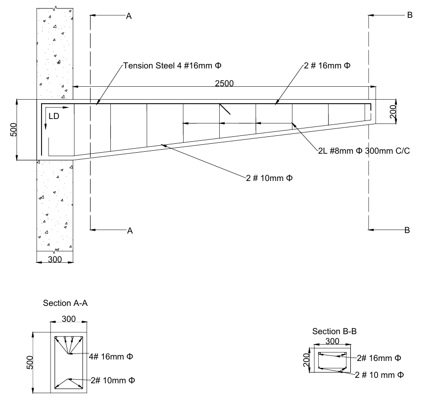
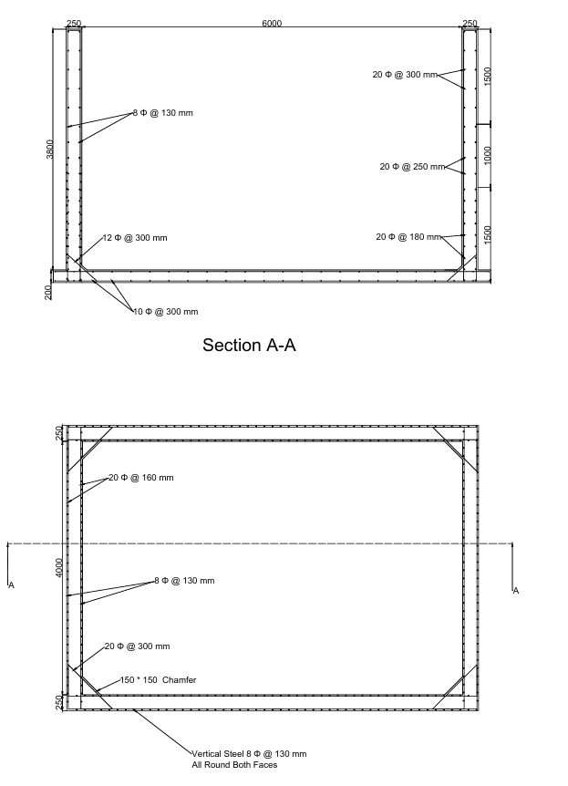
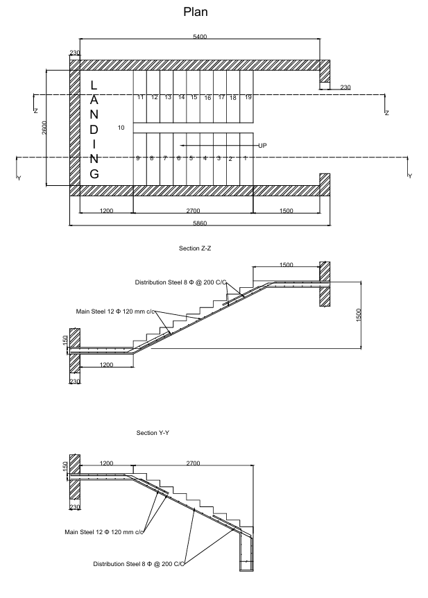

# AutoCAD RCC Drawings Collection

This repository contains a comprehensive set of AutoCAD drawings of various RCC (Reinforced Cement Concrete) structural elements. These drawings are useful for civil engineering students, professionals, and educators for academic, reference, and design purposes.

## 📁 Contents

| Drawing Name | Description | Preview |
|--------------|-------------|---------|
| `Cantilever.dwg` | RCC cantilever beam design and detailing |  |
| `Continous Slab.dwg` | RCC continuous slab detailing |  |
| `Fixed BaseTank.dwg` | Circular water tank with a fixed base |  |
| `Flexible Base Tank.dwg` | Water tank with a flexible base |  |
| `Flexible Circular Tank.dwg` | RCC circular tank with flexible base support |  |
| `Isolated Footing.dwg` | Detailing of isolated column footing |  |
| `One way Slab.dwg` | RCC one-way slab layout |  |
| `Retaining Wall.dwg` | Reinforced concrete retaining wall design |  |
| `Simply Supported DRB.dwg` | Simply supported doubly reinforced beam |  |
| `Simply Supported.dwg` | Simply supported slab or beam drawing |  |
| `Staircase.dwg` | RCC staircase plan and sectional details |  |
| `Tank Circular.dwg` | Circular tank layout |  |
| `Two Way Slab.dwg` | RCC two-way slab design |  |

## 📌 Usage

You can open these `.dwg` files using:
- AutoCAD (2013 or later recommended)
- Free viewers like Autodesk DWG TrueView
- Other compatible CAD software

## 📚 Ideal For

- Civil engineering academic projects
- Structural design reference
- Classroom and lab instruction
- Structural drafting practice

## 🧑‍🏫 Credits

Prepared under the guidance of **Dr. Nagashree**.

## 📄 License

This project is shared for educational and academic use only. Please credit the original authors for any use or redistribution.

